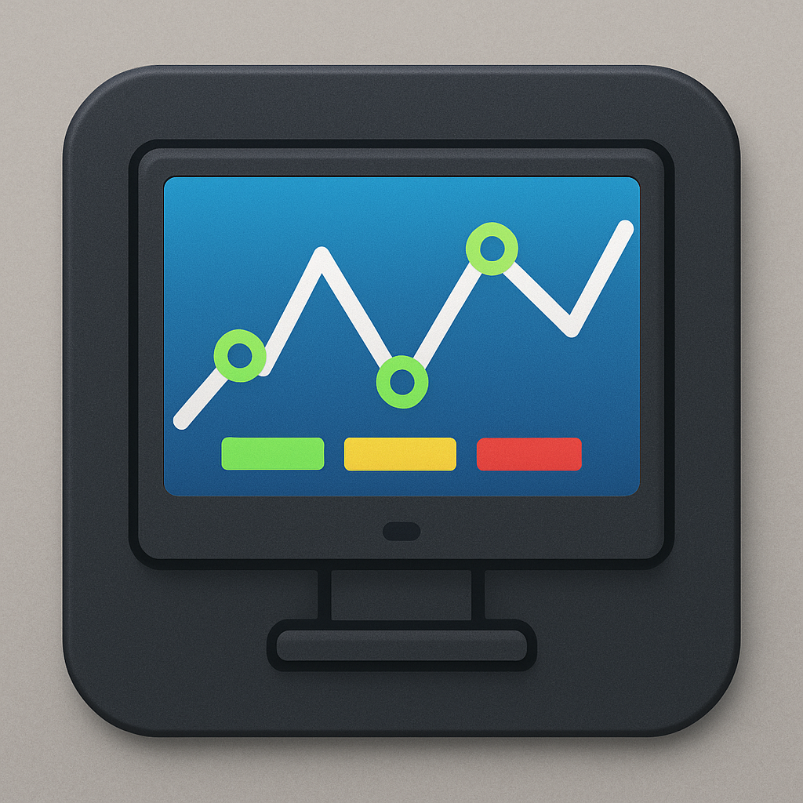

# DeskViz

A modular desktop widget system for Windows with real-time hardware monitoring, Meshtastic mesh radio integration, and a plugin-based architecture.



## Features

- **CPU Monitor** - Real-time usage, temperature, clock speed, and power consumption per core
- **RAM Monitor** - Memory usage with visual progress bars
- **Clock** - Customizable 12/24-hour time display
- **Meshtastic** - Mesh radio chat, node list, GPS, telemetry via serial connection
- **Logo** - Configurable branding widget
- **Multi-Page Dashboard** - Organize widgets across up to 5 pages with swipe/keyboard navigation
- **Auto-Rotation** - Cycle through pages automatically (forward, reverse, ping-pong modes)
- **Auto-Update** - Checks GitHub Releases for app and widget updates
- **System Tray** - Runs minimized with context menu access
- **Plugin System** - Widgets are standalone DLLs, hot-discoverable at runtime

## Installation

### Installer (Recommended)

Download the latest `DeskViz-Setup-x.x.x.exe` from [Releases](https://github.com/ril3y/deskviz/releases) and run it.

### Portable

Download `DeskViz.App.exe` and `widgets.zip` from [Releases](https://github.com/ril3y/deskviz/releases). Extract widgets into a `WidgetOutput/` folder next to the exe.

### Build from Source

```powershell
git clone https://github.com/ril3y/deskviz.git
cd deskviz/DeskViz.NET

# Build and run with all plugins
.\build.ps1 -Run

# Build plugins only
.\build.ps1 -Plugins

# Release package (single-file exe)
.\build.ps1 -Configuration Release -Package

# Run tests
dotnet test
```

## System Requirements

- Windows 10 version 1809+ / Windows 11
- .NET 8.0 (bundled in installer and single-file exe)
- Administrator privileges for hardware monitoring

## Navigation

| Input | Action |
|-------|--------|
| Swipe left/right | Navigate pages |
| Arrow keys, PageUp/PageDown | Navigate pages |
| Number keys 1-9 | Jump to page |
| Swipe down / Space / F2 | Open page selector |

## Plugin Architecture

Widgets are self-contained .NET class library DLLs loaded at runtime via reflection:

```
DeskViz.NET/
├── DeskViz.App/                    # WPF host application
├── DeskViz.Core/                   # Core services (hardware, settings, updates)
├── DeskViz.Plugins/                # Plugin interfaces and base classes
├── DeskViz.Widgets.Cpu/            # CPU monitor plugin
├── DeskViz.Widgets.Clock/          # Clock plugin
├── DeskViz.Widgets.Ram/            # RAM monitor plugin
├── DeskViz.Widgets.Logo/           # Logo plugin
├── DeskViz.Widgets.Meshtastic/     # Meshtastic radio plugin
├── WidgetOutput/                   # Built plugin DLLs (runtime)
└── installer/                      # Inno Setup installer script
```

### Creating a Widget Plugin

1. Create a new project `DeskViz.Widgets.YourWidget/` referencing `DeskViz.Plugins`
2. Extend `BaseWidget` and implement `IWidgetPlugin`
3. Define `WidgetId`, `DisplayName`, `Metadata`, `RefreshData()`, `CreateSettingsUI()`
4. Create your XAML view
5. Build with `.\build.ps1 -Plugins` - your DLL lands in `WidgetOutput/`

Plugins are distributed as DLLs. Drop a widget DLL into the `WidgetOutput/` folder and restart DeskViz.

## Auto-Update

DeskViz checks GitHub Releases on startup for new versions. When an update is available:

- **App updates** - Downloads new exe, applies via restart
- **Widget updates** - Downloads new widget DLLs from `widgets.zip`

Disable in Settings or skip individual versions. Manual check available via system tray > "Check for Updates".

## Configuration

Settings are stored at `%APPDATA%/DeskViz/settings.json` and include:

- Multi-page layouts with per-page widget visibility and ordering
- Per-widget settings (update intervals, display options)
- Auto-rotation (interval, mode, pause on interaction)
- Display selection for multi-monitor setups
- Auto-update preferences

## CI/CD

- **CI**: Builds and tests on every push/PR to master
- **Release**: Tag a version (`git tag v1.0.0 && git push --tags`) to automatically build and publish:
  - `DeskViz.App.exe` - Self-contained single-file executable
  - `widgets.zip` - All plugin widget DLLs
  - `DeskViz-Setup-x.x.x.exe` - Windows installer (Inno Setup)

## Contributing

1. Fork the repository
2. Create a feature branch (`git checkout -b feature/my-widget`)
3. Build and test (`.\build.ps1 -Plugins && dotnet test`)
4. Submit a pull request

## Acknowledgments

- [LibreHardwareMonitor](https://github.com/LibreHardwareMonitor/LibreHardwareMonitor) - Hardware monitoring
- [Meshtastic](https://meshtastic.org/) - Mesh radio protocol
- [Inno Setup](https://jrsoftware.org/isinfo.php) - Windows installer
